<picture>
  <source media="(prefers-color-scheme: dark)" srcset="assets/header-en-dark.svg">
  
</picture>

  
  
  

### ⚡ About me

Full-stack developer with 10+ years contributing to complete business systems: from data model and APIs to web and mobile apps. Most recently I worked remotely for a US company on real-time 4G/5G mobile network monitoring platforms for telecom regulators across Latin America.

- 🔭 **Now:** looking for a remote full-stack role.
- 🧱 **How I work:** hexagonal architecture, Clean Architecture, monorepos and Scrum with Jira.
- 🌱 **Learning:** AI agent development and Google Cloud.
- 🤝 **Community service:** web platforms for the City of Maracaibo.

<picture>
  <source media="(prefers-color-scheme: dark)" srcset="assets/stack-en-dark.svg">
  
</picture>

<picture>
  <source media="(prefers-color-scheme: dark)" srcset="assets/timeline-en-dark.svg">
  
</picture>

### 🛠️ Public projects

| Project | What it is |
| --- | --- |
| [**project-skills**](https://github.com/jesuszeus/project-skills) | Claude Code skills that generate complete PHP modules (CRUD, statistics, export) from forms, PDFs or spreadsheets. |
| [**jesuszeus.github.io**](https://github.com/jesuszeus/jesuszeus.github.io) | My bilingual portfolio, with downloadable résumé in Spanish and English. |